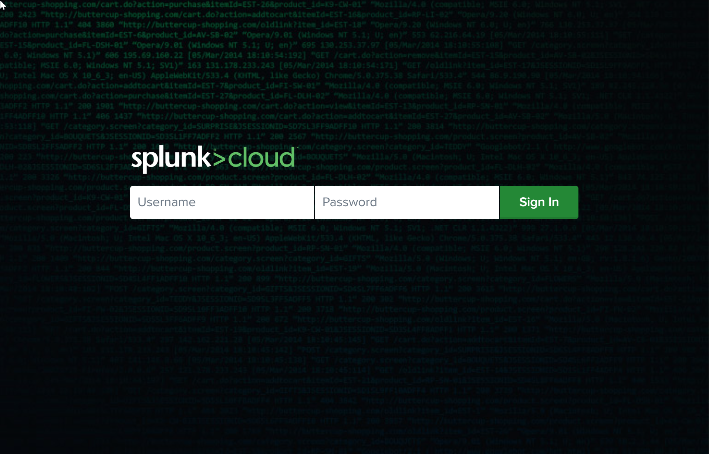
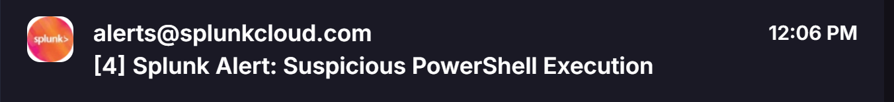

# IT Ops Incident Workflow Simulation

**Splunk detection → Alert → Jira incident → Priority SLAs & escalation → Evidence attached.**  
End-to-end, portfolio-ready simulation: connect SIEM detections to service management with SLAs and audit evidence.
## What’s in this repo
IT-Ops-Workflow-Sim/
├─ scripts/
│  ├─ powershell-ad-export.ps1
│  └─ Fix-HighCPU.ps1
├─ logs/
│  └─ sysmon_sample.log.txt
├─ splunk/
│  ├─ splunk-login.png
│  ├─ splunk-upload-source.png
│  ├─ splunk-upload-review.png
│  ├─ splunk-search-result.png
│  ├─ splunk-alert-config.png
│  ├─ splunk-alert-triggered.png
│  ├─ splunk-alert-email.png
│  ├─ splunk-alert-email-alt.png
│  └─ jira-splunk-alert-ticket.png
└─ jira/
├─ jira-incident-critical.png
├─ jira-incident-high.png
├─ jira-incident-medium.png
├─ jira-incident-low.png
└─ jira-sla-breach.png
## Workflow overview

```mermaid
flowchart LR
A[Endpoint/User] --> B[Logs]
B --> C[Splunk: Search & Alert]
C -->|Email/Integration| D[Jira Incident]
D --> E[SLA Timers]
E -->|Breach| F[Escalate (assign/notify)]
D --> G[Attach Evidence (AD CSV)]
G --> H[Resolve / Close]
Prerequisites
	•	Splunk (Cloud trial or Enterprise)
	•	Jira Service Management (ITSM/Service project)
	•	Windows PowerShell
---

### 4/7 — How to reproduce (Splunk)
```markdown
## How to reproduce the simulation

### 1) Splunk — ingest, search, alert
1. **Ingest:** Add Data → Upload → `logs/sysmon_sample.log.txt`  
   Sourcetype: `sysmon_sample`, Index: `main`  
   _Refs:_ `splunk/splunk-upload-source.png`, `splunk/splunk-upload-review.png`
2. **Verify:** Search
```spl
index=main sourcetype=sysmon_sample powershell.exe
Ref: splunk/splunk-search-result.png
3. Alert: Save search as alert “Suspicious PowerShell Execution”
Schedule: every minute (cron */1 * * * *) • Trigger: results > 0 • For each result • Action: Send Email
Refs: splunk/splunk-alert-config.png, splunk/splunk-alert-triggered.png, splunk/splunk-alert-email*.png

Tip: If “Real-time” isn’t available, a 1-minute schedule is fine for demo.
---

### 5/7 — Jira steps
```markdown
### 2) Jira — incident, SLAs, escalation
1. **Incident request type** with fields: Summary, Description, **Service Affected**, **Priority**, **Root Cause**, **Resolution Notes**.  
   _Refs:_ `jira/jira-incident-*.png`
2. **Priority SLAs** (example targets)  
   Highest 4h (use **1m** temporarily to force a breach), High 24h, Medium 36h, Low 48h.  
   _Refs:_ `jira/jira-incident-*.png`
3. **Escalation on breach**  
   Rule: When **Critical Incident Resolution SLA** is *breached* AND Priority=Highest → **Assign Tier-2 / notify**.  
   _Ref:_ `jira/jira-sla-breach.png`
### 3) Evidence script (PowerShell)
Export an “AD change log” CSV and attach to the incident.

```powershell
Set-ExecutionPolicy -Scope Process -ExecutionPolicy Bypass
cd "$env:USERPROFILE\Documents\IT-Ops-Workflow-Sim\scripts"
.\powershell-ad-export.ps1
	•	Default path in script: C:\IT-Ops-Lab\AD_ChangeLog.csv (create folder or change $ExportPath).

Success criteria
	•	Splunk ingests & alert fires.
	•	Jira shows priority SLAs; breach triggers escalation.
	•	Evidence CSV is attached in-ticket.

Troubleshooting
	•	No real-time alerts? Use scheduled (cron */1 * * * *).
	•	Script blocked? Use the session bypass above.
	•	CSV path missing? Create C:\IT-Ops-Lab\ or edit $ExportPath.
---

### 7/7 — **Images that render** (paste these exact lines)
```markdown
## Screenshot gallery

### Splunk
  
  
  
  
  
  
  
  


### Jira
  
  
  
  


---

## Git quick commands
```bash
git add .
git commit -m "Update README and screenshots"
git push origin main
---

If you prefer a **super-minimal version** that’s only images (to get it working first), paste just block **7/7** into your README and save; images will render immediately. Then you can add the other blocks later.