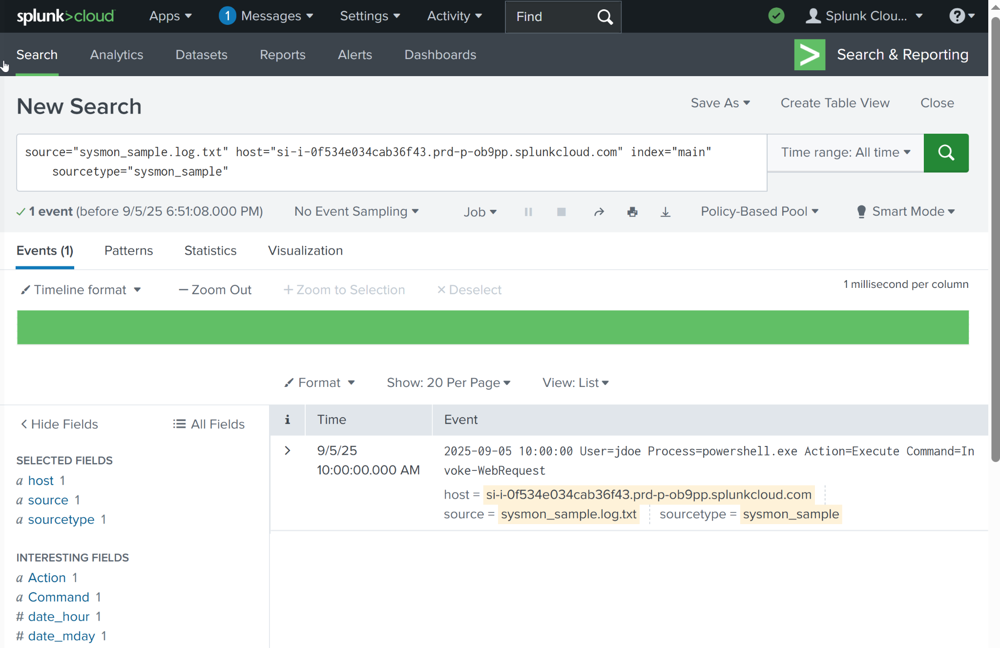
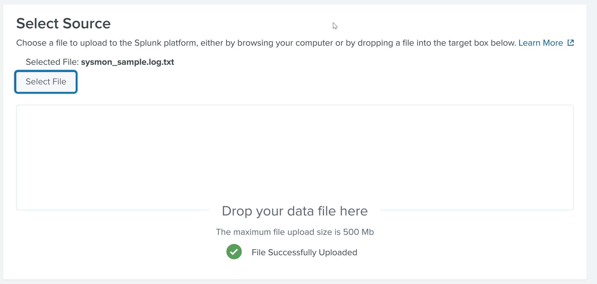
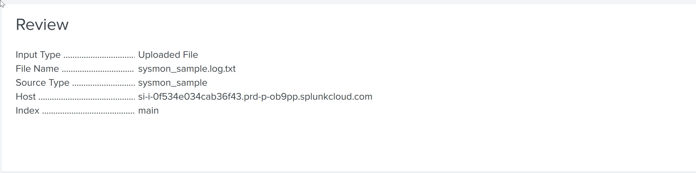
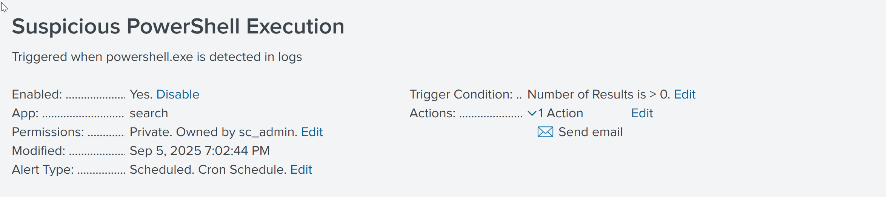
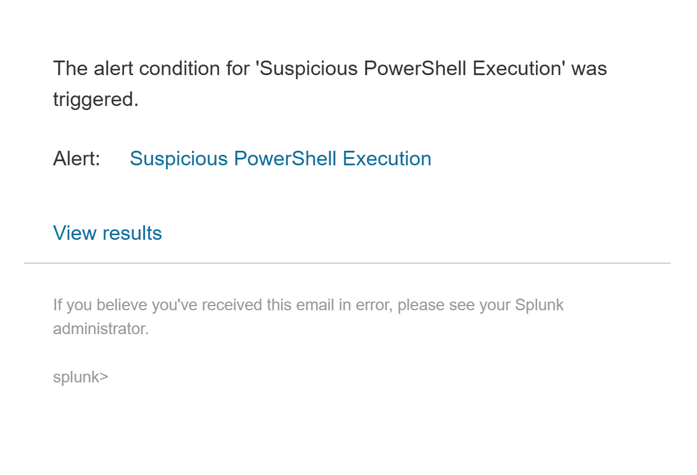
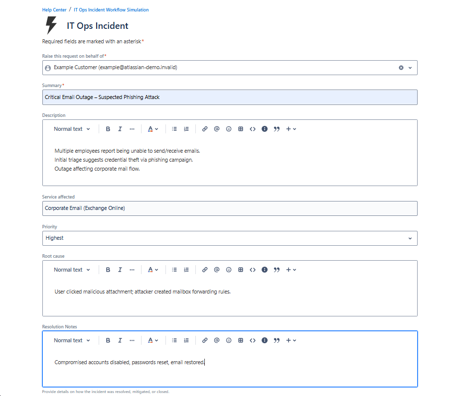
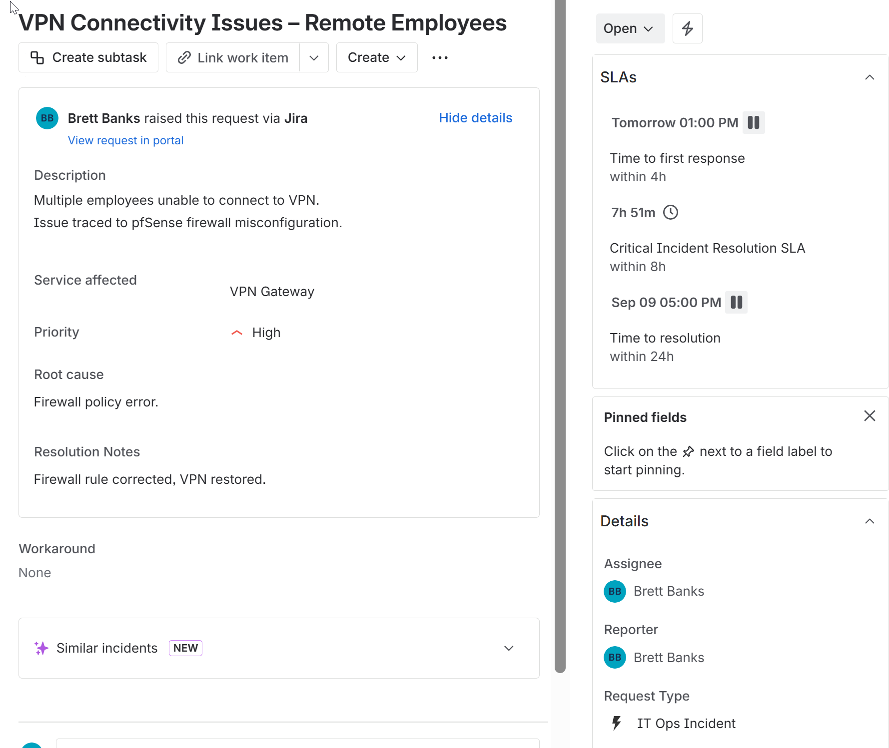
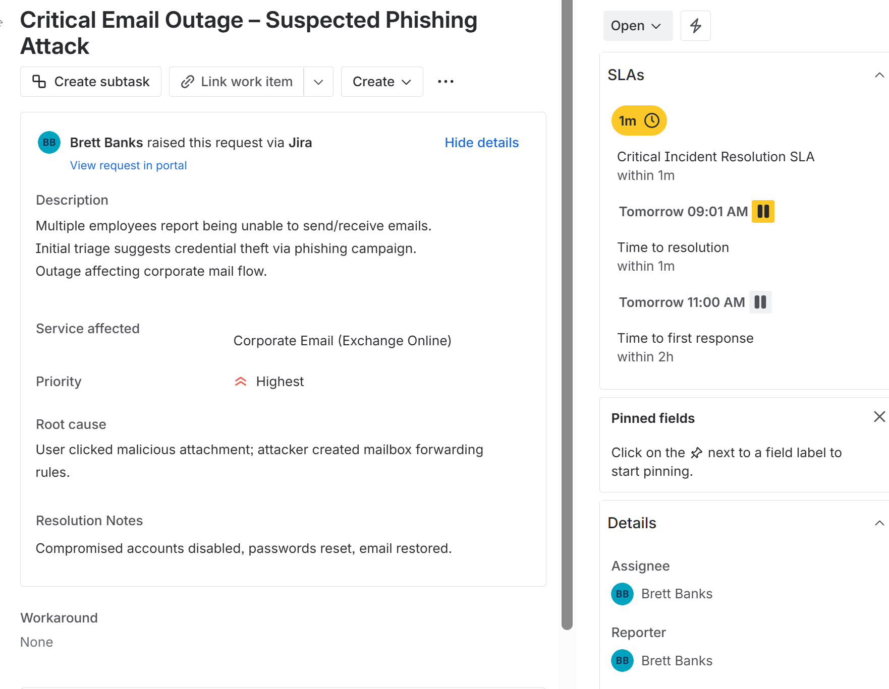

#  IT Ops Incident Workflow Simulation  

End-to-end incident flow to demonstrate practical **IT Ops & SecOps skills**.  
This project simulates detection, ticketing, SLA tracking, escalation, and evidence handling using free tools.  

---
##  Why This Project Matters
This project mirrors enterprise SOC workflows using free tools.
It demonstrates:
- Threat detection in Splunk
- Automated incident creation in Jira
- SLA enforcement & escalation handling
- Evidence export for compliance

Recruiters: this is the workflow I can bring to your SOC team.  

---

##  What You’ll Build  
**Detection → Ticketing → SLA → Escalation → Evidence**  

---

## ⚙ Prerequisites  
- Splunk Cloud (trial or dev instance)  
- Jira Service Management (free plan is fine)  
- Windows PowerShell  

---

##  Demo Screenshot  
  

---

##  Table of Contents  
- [Repository Structure](#-repository-structure)  
- [Step-by-Step](#-step-by-step)  
  - [Splunk](#1-splunk--ingest-search-alert)  
  - [Jira](#2-jira--incident--slas--escalation)  
  - [Evidence](#3-evidence--export-ad-change-log-powershell)  
- [SLA Targets](#-sla-targets)  
- [SPL Used](#-spl-used)  
- [Git Quick Commands](#-git-quick-commands)  
- [Notes](#-notes)  

---

##  Repository Structure  
```text
IT-Ops-Incident-Workflow-Simulation/
├── scripts/                # automation
│   ├── Fix-HighCPU.ps1
│   └── powershell-ad-export.ps1
├── logs/                   # sample data
│   └── sysmon_sample.log.txt
├── splunk/                 # Splunk steps & alert
│   ├── splunk-login.png
│   ├── splunk-upload-source.png
│   ├── splunk-upload-review.png
│   ├── splunk-search-result.png
│   ├── splunk-alert-config.png
│   ├── splunk-alert-triggered.png
│   ├── splunk-alert-email.png
│   ├── splunk-alert-email-alt.png
│   └── jira-splunk-alert-ticket.png
└── jira/                   # Jira incidents & SLA views
    ├── jira-incident-critical.png
    ├── jira-incident-high.png
    ├── jira-incident-medium.png
    ├── jira-incident-low.png
    └── jira-sla-breach.png
```

---

##  Step-by-Step  

### 1) Splunk — Ingest, Search, Alert  
**Upload sample log:**  
  

**Review before indexing:**  
  

**Search suspicious PowerShell activity:**  
```spl
index="main" sourcetype="sysmon_sample" powershell OR "Invoke-WebRequest"
```  
  

**Create alert:**  
  

**Triggered alert:**  
  

**Alert email example:**  
  

---

### 2) Jira — Incident + SLAs + Escalation  
**Critical incident example:**  
  

**Low → High priority timers:**  
  

**Escalation breach example:**  
  

---

### 3) Evidence — Export AD Change Log (PowerShell)  
Run evidence export:  
```powershell
Set-ExecutionPolicy -Scope Process -ExecutionPolicy Bypass
.\scripts\powershell-ad-export.ps1
```  

Attach exported `AD_ChangeLog.csv` to Jira ticket.  

---

##  SLA Targets  
| Priority | First Response | Resolution |  
|----------|----------------|------------|  
| Highest  | 2h             | 4h         |  
| High     | 4h             | 24h        |  
| Medium   | 6h             | 36h        |  
| Low      | 8h             | 48–72h     |  

---

##  SPL Used  
```spl
index=main sourcetype=sysmon_sample (Process="powershell.exe" OR Command="*Invoke-WebRequest*")
| table _time host User Process Command
| sort - _time
```  

---

## 🛠 Git Quick Commands  
```bash
git add .
git commit -m "Update README with screenshots"
git push origin main
```  

---

## 🗒️ Notes  
This repo simulates an end-to-end SOC workflow using free tools (Splunk, Jira, PowerShell).  
It is designed as a **practical lab** to demonstrate IT Ops + SecOps workflows.  
