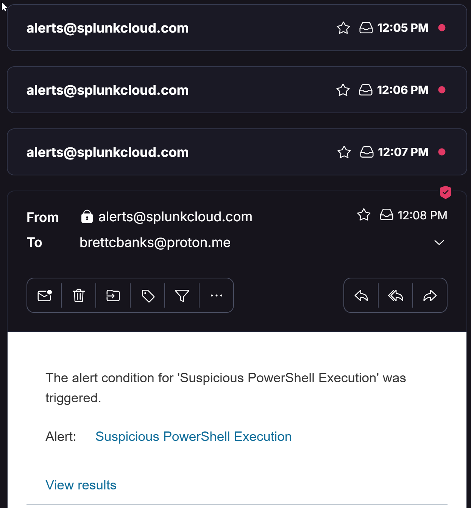

# IT Ops Incident Workflow Simulation

End-to-end incident flow to demonstrate practical IT Ops & SecOps skills:

- **Detection (Splunk):** Ingest a sample Sysmon log and alert on suspicious PowerShell.
- **Triage (Jira):** Create a Jira incident and track it with **priority SLAs**.
- **SLA Enforcement:** Visual timers + an **escalation rule** on breach.
- **Evidence:** PowerShell exports an **AD change log (CSV)** and it’s attached to the ticket.

<p align="center">
  
</p>

---

## Table of contents
- [Repository structure](#repository-structure)
- [Prerequisites](#prerequisites)
- [Step-by-step](#step-by-step)
  - [1) Splunk — ingest, search, alert](#1-splunk--ingest-search-alert)
  - [2) Jira — incident + SLAs + escalation](#2-jira--incident--slas--escalation)
  - [3) Evidence — export AD change log (PowerShell)](#3-evidence--export-ad-change-log-powershell)
- [SLA targets](#sla-targets)
- [SPL used](#spl-used)
- [Git quick commands](#git-quick-commands)
- [Notes](#notes)

---

## Repository structure
```text
IT-Ops-Incident-Workflow-Simulation/
├─ scripts/                     # automation
│  ├─ Fix-HighCPU.ps1
│  └─ powershell-ad-export.ps1
├─ logs/                        # sample data
│  └─ sysmon_sample.log.txt
├─ splunk/                      # Splunk steps & alert
│  ├─ splunk-login.png
│  ├─ splunk-upload-source.png
│  ├─ splunk-upload-review.png
│  ├─ splunk-search-result.png
│  ├─ splunk-alert-config.png
│  ├─ splunk-alert-triggered.png
│  ├─ splunk-alert-email.png
│  ├─ splunk-alert-email-alt.png
│  └─ jira-splunk-alert-ticket.png
└─ jira/                        # Jira incidents & SLA views
   ├─ jira-incident-critical.png
   ├─ jira-incident-high.png
   ├─ jira-incident-medium.png
   ├─ jira-incident-low.png
   └─ jira-sla-breach.png
Prerequisites
Splunk Cloud/Enterprise (trial is fine)

Jira Service Management (ITSM/Service project)

Windows PowerShell (for the evidence script)

Step-by-step
1) Splunk — ingest, search, alert
Upload sample log
Add Data → Upload → choose logs/sysmon_sample.log.txt → set a simple sourcetype (e.g., sysmon_sample) → index main.

<p align="center">  </p>
Review & index
Confirm fields look sane, then continue.

<p align="center">  </p>
Search for suspicious PowerShell

spl
Copy code
index="main" sourcetype="sysmon_sample" (powershell OR "Invoke-WebRequest")
<p align="center">  </p>
Create an alert
Save as Alert: “Suspicious PowerShell Execution” → Trigger Number of results > 0 → (for demo) schedule every minute → Action Send email (or webhook/Jira).

<p align="center">  </p>
When it fires:

<p align="center">  </p> <p align="center">  </p>
(Optional) If you create a Jira issue from a webhook/mail handler:

<p align="center">  </p>
2) Jira — incident + SLAs + escalation
Create/inspect the incident
Fill Summary, Description, Service affected, Priority, Root cause, Resolution Notes.

<p align="center">  </p>
Validate priority SLAs
Timers should reflect policy and priority.

<p align="center">   </p> <p align="center">  </p>
Test escalation on breach
Use a short target (e.g., 1 minute) on Critical Incident Resolution SLA to demonstrate breach → auto-assign / notify.

<p align="center">  </p>
3) Evidence — export AD change log (PowerShell)
Script: scripts/powershell-ad-export.ps1
Default export path inside the script: C:\IT-Ops-Lab\AD_ChangeLog.csv (create the folder or change $ExportPath).

Run

powershell
Copy code
# one-session bypass for scripts
Set-ExecutionPolicy -Scope Process -ExecutionPolicy Bypass

# run from repo root or adjust path
.\scripts\powershell-ad-export.ps1
Attach the resulting CSV to the Jira incident as audit evidence.

SLA targets
Priority	Time to first response	Time to resolution
Highest	2h	4h
High	4h	24h
Medium	6h	36h
Low	8h	48–72h

SPL used
spl
Copy code
index=main sourcetype=sysmon_sample (Process="powershell.exe" OR Image="*\\powershell.exe" OR Command="*Invoke-WebRequest*" OR Command="*EncodedCommand*")
| table _time host User Process Command
| sort - _time
